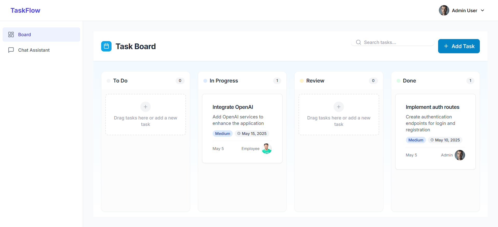
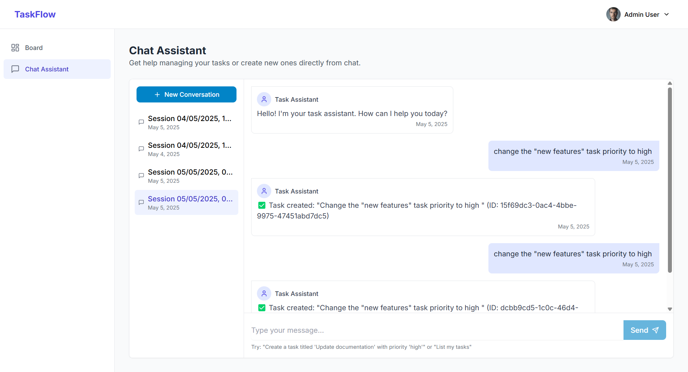

# Permitron: AI-Powered Task Management with Fine-Grained Permissions

**GitHub Repository:** [https://github.com/yourusername/permitron](https://github.com/yourusername/permitron)  
**Live Preview:** [https://permitron-demo.netlify.app](https://permitron-demo.netlify.app)

## Project Overview

Permitron is an intelligent task management application that combines the power of LLM-based chatbots with Permit.io's robust permission management system. The application enables users to create, update, track, and manage tasks using natural language through a conversational interface, while enforcing strict permission controls based on user roles and context.

## Key Features

1. **Natural Language Task Management**
   - Create tasks via conversational commands: "Create a task for adding new feature"
   - Update tasks: "Update task #123 with title: Improved API integration"
   - Change task status: "Move task #123 to in-progress"
   - Delete tasks: "Delete task #123"
   - List tasks with filtering: "Show me my in-progress tasks"

2. **Kanban Board Visualization**
   - Visual task board with draggable cards
   - Columns for Todo, In Progress, Review, and Done
   - Status updates sync between chat and board interfaces

3. **Fine-Grained Permissions with Permit.io**
   - Role-based access control (Admin, Employee, Guest)
   - Attribute-based permissions (task ownership, assignment)
   - LLM operation authorization

4. **Chat Interface Integration**
   - Conversational AI powered by OpenAI
   - Context-aware responses
   - Permission-aware task operations

## Technical Architecture

### Frontend (React + TypeScript)
- React-based SPA with TypeScript
- Zustand for state management
- Tailwind CSS for styling
- Integrated chat interface and kanban board

### Backend (Node.js + Express)
- Express-based REST API
- OpenAI integration for natural language processing
- Permit.io SDK for authorization
- In-memory data store (could be replaced with a database)

## Permit.io Integration

Permitron leverages Permit.io's powerful authorization system to implement fine-grained access controls for LLM-based task operations. Here's how Permit.io is integrated:

### 1. Resource-Based Authorization

We've defined two key resources in our Permit.io configuration:

```yaml
resources:
  - key: task
    name: Task
    description: A task in the system
    attributes:
      - key: status
        type: string
      - key: assignedTo
        type: string
      - key: createdBy
        type: string
    actions:
      - key: create
        name: Create
      - key: read
        name: Read
      - key: update
        name: Update
      - key: delete
        name: Delete
      - key: change_status
        name: Change Status

  - key: llm
    name: LLM
    description: LLM functions
    actions:
      - key: manage_tasks
        name: Manage Tasks
```

### 2. Role-Based Permissions

We've implemented different roles with varying levels of access:

```yaml
roles:
  - key: admin
    name: Admin
    permissions:
      - resource: task
        actions: ["create", "read", "update", "delete", "change_status"]
      - resource: llm
        actions: ["manage_tasks"]
        
  - key: employee
    name: Employee
    permissions:
      - resource: task
        actions: ["create", "read"]
        condition: "{ assignedTo: user.id } OR { createdBy: user.id }"
      - resource: task
        actions: ["update", "delete", "change_status"]
        condition: "{ createdBy: user.id }"
      - resource: llm
        actions: ["manage_tasks"]
        
  - key: guest
    name: Guest
    permissions:
      - resource: task
        actions: ["read"]
```

### 3. LLM Assistant Integration

A unique aspect of our implementation is the integration of Permit.io with the LLM task processor. When a user asks the chatbot to perform a task operation, the system:

1. Identifies the user's intent (create/update/delete/etc.)
2. Extracts the task details from natural language
3. **Checks permission with Permit.io before execution**
4. Executes the task operation only if permitted
5. Provides clear feedback about permission status

Example code snippets showing this integration:

```javascript
// Check permission for task creation
try {
  const permitted = permit ? 
    await permit.check({
      user: { id: userId, key: userId },
      action: "create",
      resource: "task"
    }) : true;
  
  if (!permitted) {
    return {
      actionTaken: true,
      action: 'create_task',
      success: false,
      response: "❌ You don't have permission to create tasks."
    };
  }
} catch (error) {
  console.error('Permit.io check error:', error);
}
```

### 4. Attribute-Based Access Control (ABAC)

For operations on existing tasks, we use attribute-based permissions to check if the user is the creator or is assigned to the task:

```javascript
// For updating tasks
permitted = await permit.check({
  user: { id: userId, key: userId },
  action: "update",
  resource: "task",
  context: {
    task: {
      createdBy: task.createdBy,
      assignedTo: task.assignedTo
    }
  }
});
```

This enables contextual permission checks based on the task's properties and the user's relationship to it.

### 5. LLM-Specific Permissions

We've introduced a specific permission for using the LLM to manage tasks:

```javascript
// Check if LLM can manage tasks on user's behalf
if (permit && !actionTaken) {
  const permitted = await permit.check({
    user: { id: userId, key: userId },
    action: "manage_tasks",
    resource: "llm"
  });
  
  if (!permitted) {
    return {
      actionTaken: true,
      success: false,
      response: "❌ You don't have permission to use the LLM for task management operations."
    };
  }
}
```

This adds an additional layer of control over which users can leverage AI for task management.

## Benefits of Using Permit.io

1. **Separation of Concerns**: Authorization logic is cleanly separated from application code
2. **Fine-Grained Control**: Permissions based on roles, attributes, and context
3. **Natural Language Understanding with Authorization**: LLM understands not just what the user wants to do, but whether they're allowed to do it
4. **User-Friendly Feedback**: Clear permission-related responses from the chatbot
5. **Scalable Permission Model**: Easy to add new roles, resources, and permissions as the application grows

## Future Enhancements

1. Implement user authentication with JWT integration
2. Add team-based permissions using Permit.io's tenancy model
3. Create an audit log of all permission decisions
4. Implement permission caching for performance optimization
5. Add permission-aware UI elements that hide/show based on user permissions

## Conclusion

Permitron demonstrates how combining Permit.io's powerful authorization capabilities with AI-powered interfaces creates a secure, user-friendly task management system. By ensuring that the LLM understands and respects permission boundaries, we've created an application that leverages the power of AI while maintaining robust security controls.

## Application Screenshots

### Board View


### Chatbot View
